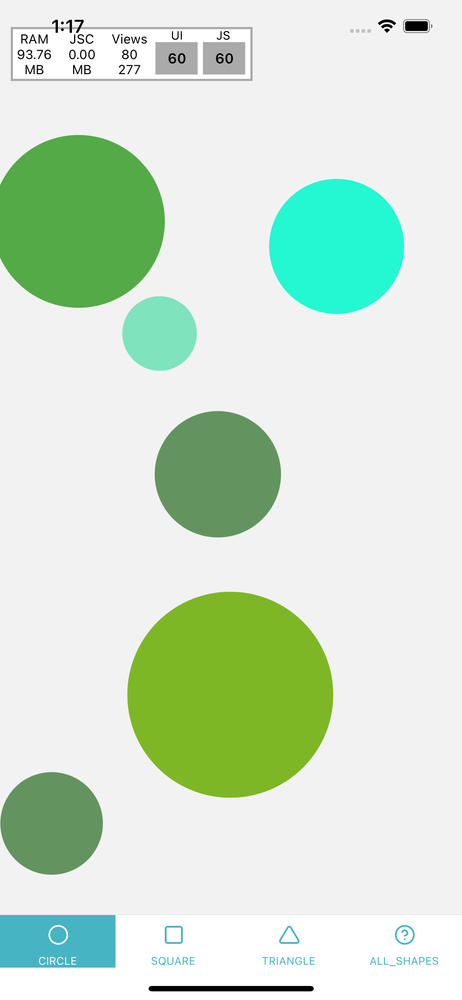

# Demo

# shape-generator.
- [x] A user should be able to spawn an infinite number of squares or circles filled with random colours or images.
- [x] Application consists of 4 screens using a tab bar. The tabs are as follows:
*  Squares - this screen only spawns squares.
*  Circles - this screen only spawns circles.
*  Triangles - this screen only spawns triangles.
*  All - this screen spawns squares, circles and triangles randomly.
- [x] Create squares, circles or triangles which randomly fill with random colours or images when the user taps on the main background.
- [x] Created shapes are placed at the user's tapped location.
- [x] Create a shape at a random size within appropriate ranges. A shape should not be more than 45% the width or height of the screen size and should never be less than 10% the width or height.
- [x] Fill circles with a colour that is generated by calling the API from http://www.colourlovers.com/api/colors/random?format=json using either the RGB or Hex value.
- [x] Fill squares with an image that is generated by calling the API from http://www.colourlovers.com/api/patterns/random?format=json using the imageUrl value.
- [x] Fill triangles randomly either using the fill circle or fill square requirements above.
- [x] If no connection is available from the above API urls, use code to generate random colours.
- [x] Double tapping the shape replaces the colour or image based on the above mentioned rules.
# Extra tasks (if time allows).
- [x] When a user taps the screen, add an animation for the shapes that appear.
- [x] Remove all shapes when shaking the device.
- [x] Be able to move a shape around.
- [x] Allow a user to use the pinch action to enlarge or shrink the size of a shape.
- [x] Working app for both iOS and Android. 
